# FOC_Ctrl_STM32F4

* 基于 stm32F405rgt6 开发的 FOC 中大功率开发板

## 1 PCB设计文件

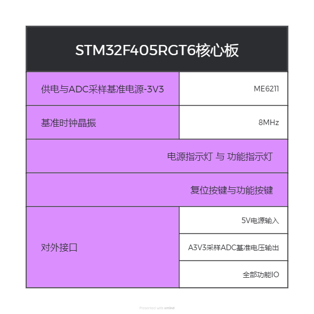

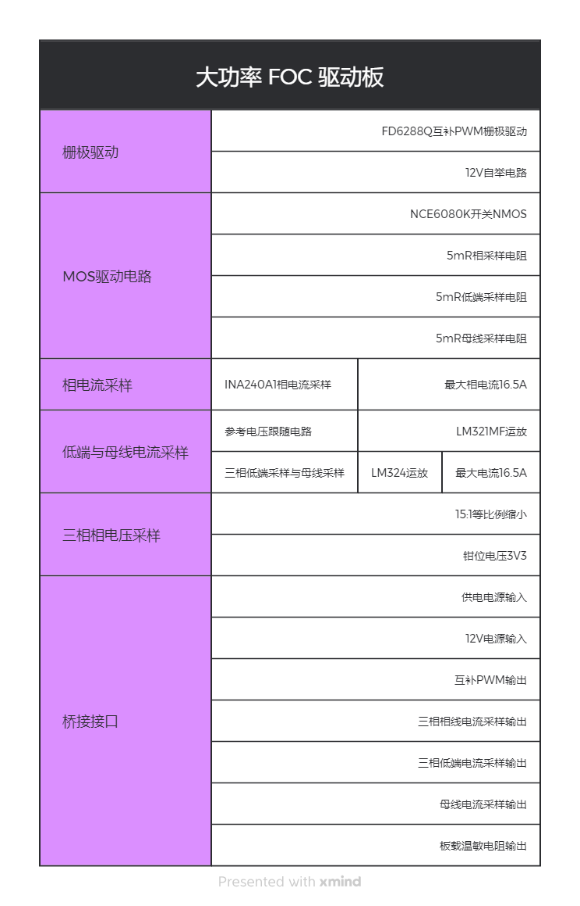

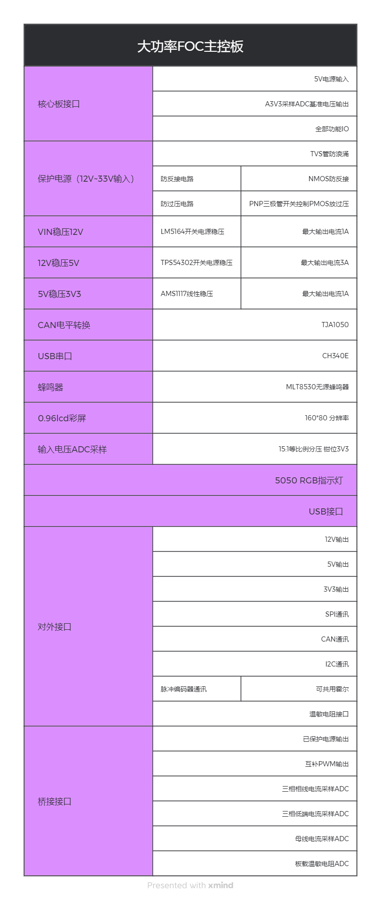

### 1 控制板设计文件

#### 1.1 输入电路设计

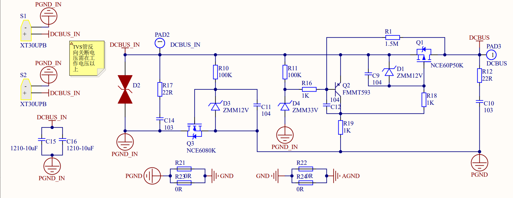

* NCE6080K nmos 实现电源防反接
* NCE60P50K pmos 通过三极管及稳压管实现防过压
* RC 电路实现环启动
* TVS 管浪涌保护

> 实测反接保护与过压保护均可实现

#### 1.2 稳压电路设计

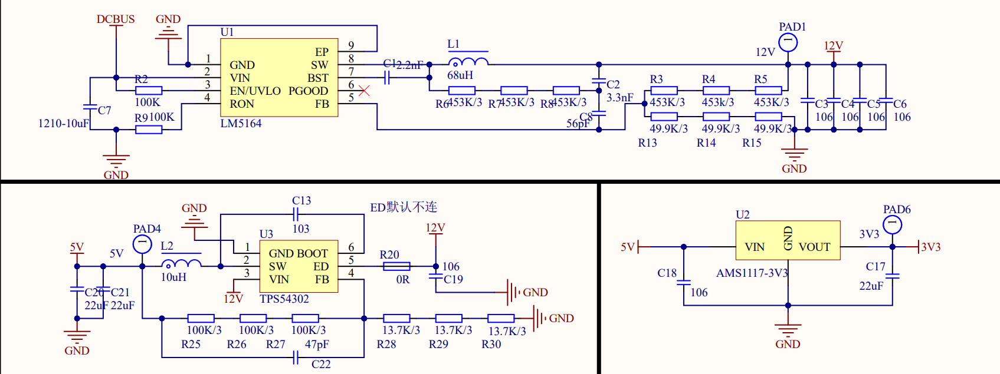

* LM5164 宽幅电压输入 ，稳压12V，最大电流1A
* TP54302 稳压5V
* AMS1117 LDO稳压3V3

> LM5164 中 C1 = 2.2nF  必须要焊接，才能正常输出，3.3nF与56pF用于减少输出纹波，具体选择大小见datasheet
>
> 输出电压计算：$R_{FB2} = \frac{1.2V}{V_{OUT}-1.2V} \cdot R_{FB1}$​
>
> 其余参数详见 datasheet

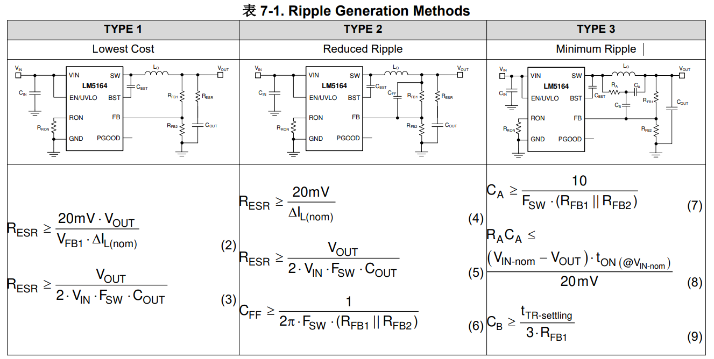

> TPS54302 ED 角位欠压锁定角，内部上拉，当ED电压低于阈值电压实现欠压锁定，一般而言悬空即可使用，不使用欠压锁定功能
>
> 输出电压计算：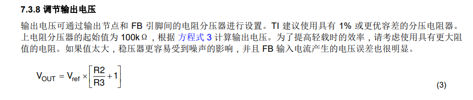
>
> $V_{ref} = 0.596V$ , R2为分压上电阻，R3为分压下电阻

#### 1.3 外设设计

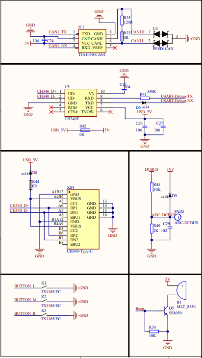

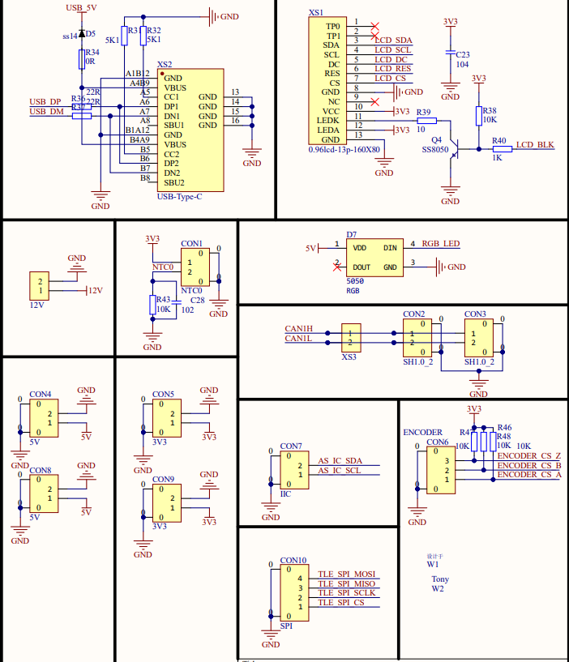

* 预留外设 CAN，USART，USB，蜂鸣器，LCD屏幕，3个独立按键，各编码器通讯及供电接口

> CAN 中断电阻可通过是否焊接或短接 0R 电阻焊盘实现
>
> 5V 网络 与 USB5V 网络可通过 0R电阻 选择是否隔离，USB5V只提供给CH340串口芯片，避免主控反复上下电需要重新选择串口
>
> 串口 USB 的5V输入串接了一个二极管，纯在 0.7V 左右的压降，根据需要选择是否焊接

### 2 驱动板设计文件

#### 2.1 栅极驱动与自举电路

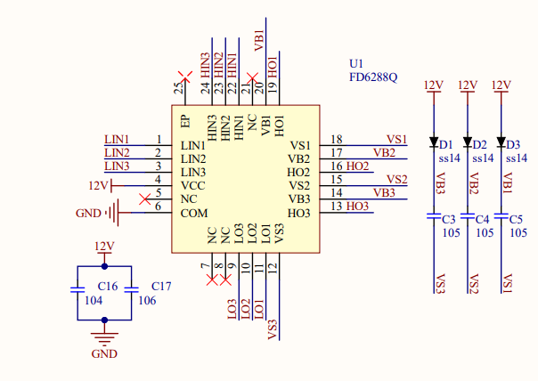

* FD6288Q 栅极驱动，自带50ns死区保护，自举12V电路

#### 2.2 逆变电路

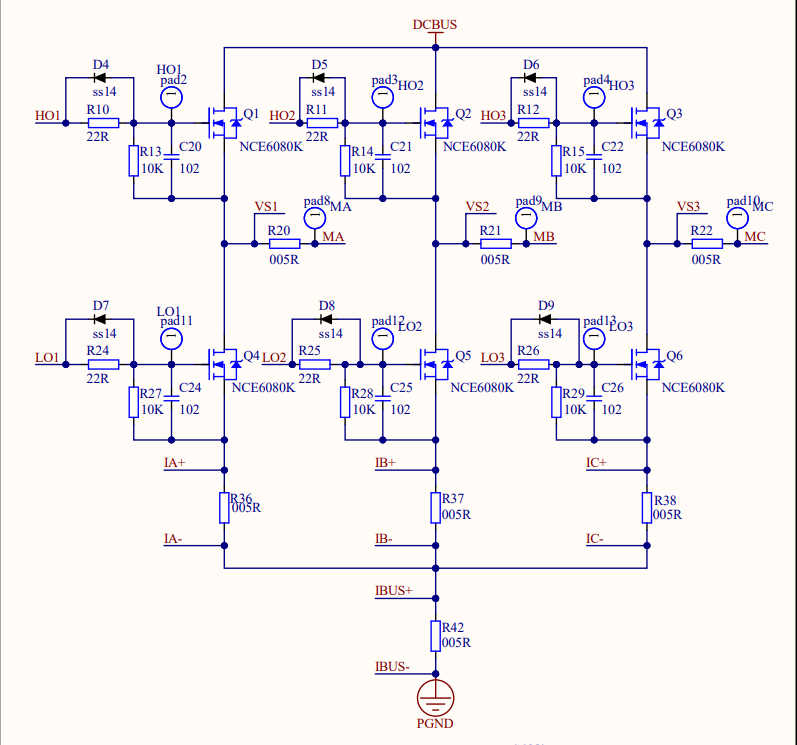

* NCE6080K nmos 搭建逆变电路
* 各相线可通过 INA240 相线电流采样
* 三低端可通过 运放电流采用
* 母线电流采样

#### 2.3 电流采样运放电路

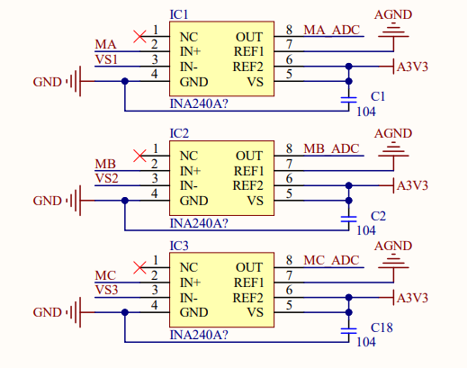

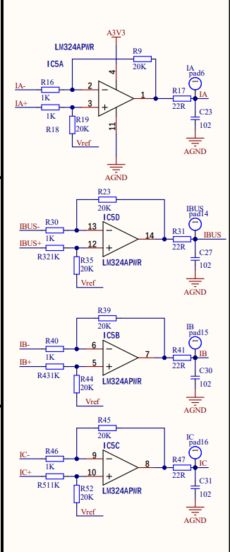

* 相线通过 INA240 采样电阻设计 5mR，可自由选择A1和A2放大倍数确定采样电流大小
* LM321MF 运放实现参考电压电压跟随
* LM324APWR 4通道运放实现母线及低端采样

## 2 软件设计

