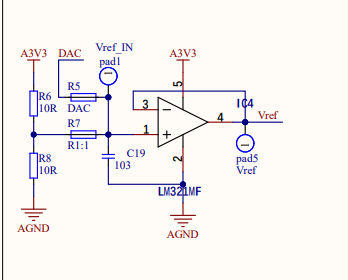

# FOC_Ctrl_STM32F4

* 基于 stm32F405rgt6 开发的 FOC 中大功率开发板

## 1 PCB设计文件

### 1 控制板设计文件

#### 1.1 输入电路设计

* NCE6080K nmos 实现电源防反接
* NCE60P50K pmos 通过三极管及稳压管实现防过压
* RC 电路实现环启动
* TVS 管浪涌保护

#### 1.2 稳压电路设计

* LM5164 宽幅电压输入 ，稳压12V，最大电流1A
* TP54302 稳压5V
* AMS1117 LDO稳压3V3

#### 1.3 外设设计

* 预留外设 CAN，USART，USB，蜂鸣器，LCD屏幕，3个独立按键，各编码器通讯及供电接口

### 2 驱动板设计文件

#### 2.1 栅极驱动与自举电路

* FD6288Q 栅极驱动，自带50ns死区保护，自举12V电路

#### 2.2 逆变电路

* NCE6080K nmos 搭建你变电路
* 各相线可通过 INA240 相线电流采样
* 三低端可通过 运放电流采用
* 母线电流采样

#### 2.3 电流采样运放电路

* 相线通过 INA240 采样电阻设计 5mR，可自由选择A1和A2放大倍数确定采样电流大小
* LM321MF 运放实现参考电压电压跟随
* LM324APWR 4通道运放实现母线及低端采样

